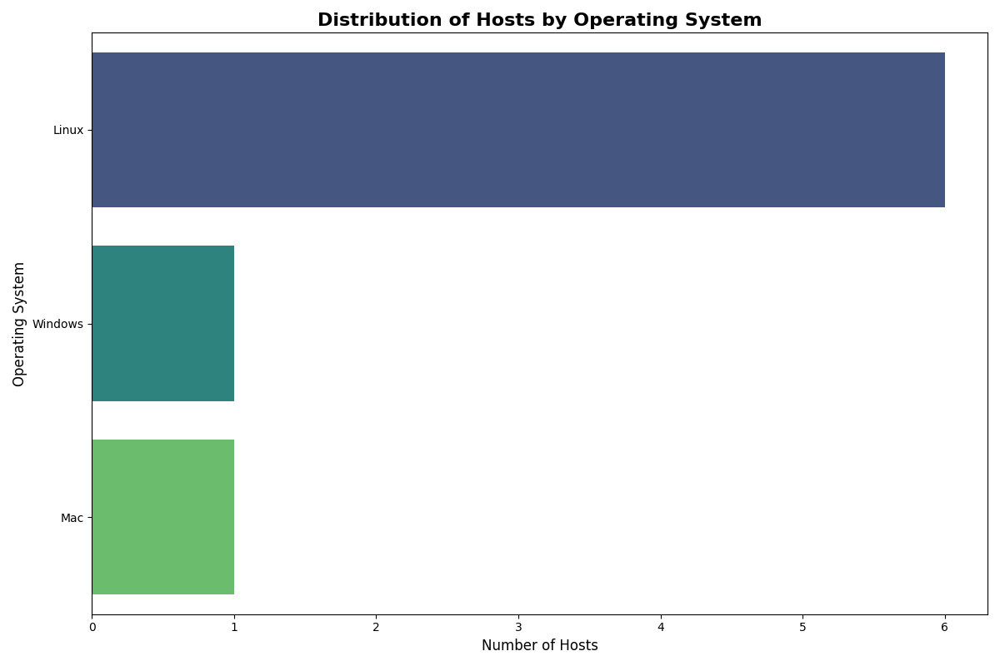
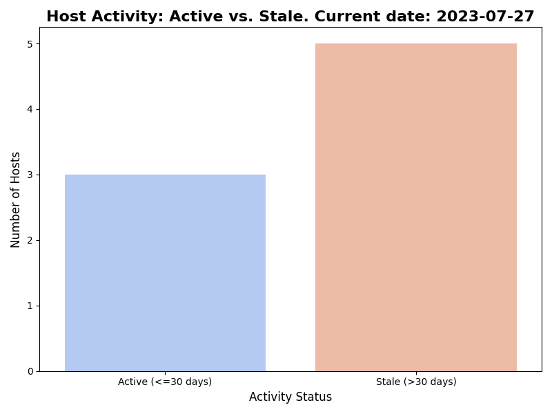
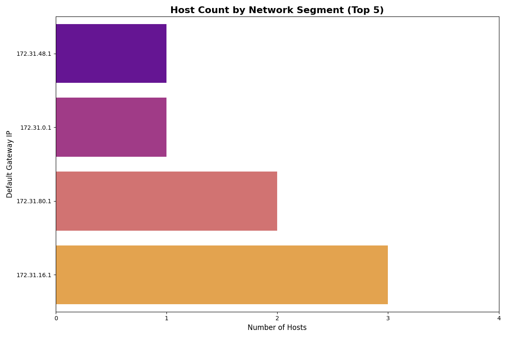

# Armis Asset Data Pipeline
### Author: Alexei Pavlovschii

This project is a scalable data engineering pipeline designed to ingest asset data from multiple sources (here used Qualys and CrowdStrike sample APIs), normalize it into a unified model, deduplicate the records, and store the resulting records in a MongoDB database. It also includes a module for analyzing the consolidated data and generating key visualizations.

The entire pipeline is built with modularity and scalability in mind, following best practices for data processing and separation of concerns.

## Technologies Used

- **Backend & Core Logic**: Python 3.10+
- **Database**: MongoDB
- **Data Analysis**: Pandas
- **Data Visualization**: Matplotlib, Seaborn
- **API Communication**: Requests
- **Containerization**: Docker, Docker Compose

## Project Structure

The project is organized into logical modules to ensure maintainability and clarity:
```
├── src/
│   ├── api_clients/      # Modules for fetching data from external APIs (Qualys, CrowdStrike)
│   ├── analysis/         # Module for analyzing data and generating charts
│   ├── models/           # Pydantic models for data structures (e.g., UnifiedHost)
│   ├── normalization/    # Logic for transforming raw source data into the unified model
│   └── deduplication/    # Intelligent, weighted logic for merging duplicate host records
├── visualizations/       # Output directory for generated charts
├── main.py               # Main script to run the full data pipeline
├── requirements.txt      # Project dependencies
├── .env                  # Local environment variables (e.g., API keys)
├── Dockerfile            # Instructions to containerize the Python application
└── docker-compose.yml    # Configuration to run the application
```

## Getting Started

These instructions will get you a copy of the project up and running on your local machine for development and testing purposes.

### Prerequisites

- Python (v3.10 or above)
- Pip (Python package installer)
- Docker and Docker Compose (for containerized setup)
- A MongoDB cloud instance (Atlas)

### Local Installation

A step-by-step guide to getting a development environment running.

1.  **Clone the repository:**
    ```sh
    git clone https://github.com/AlexDandy77/ArmisAssigment
    cd ArmisAssigment
    ```

2.  **Create and activate a virtual environment:**
    ```sh
    # For macOS/Linux
    python3 -m venv venv
    source venv/bin/activate

    # For Windows
    python -m venv venv
    .\venv\Scripts\activate
    ```

3.  **Install the dependencies:**
    ```sh
    pip install -r requirements.txt
    ```

4.  **Connect a MongoDB cluster:**
    Create a new one or use an existing cluster. Get from it full connection string (URI), e.g:
    ```
    mongodb+srv://<user>:<password>@...
    ```

5. **Set up your environment variables:**
    Create a file named `.env` in the root directory of the project and add your API token and MongoDB connection URI:
    ```env
    # .env
    API_TOKEN="your_actual_api_token_here"
    MONGO_URI="your_actual_mongodb_uri"
    ```

6. **Run the main data pipeline:**
    This will fetch, normalize, and deduplicate the data, storing it in your MongoDB database.
    ```sh
    python main.py
    ```
    After the pipeline has run, the analysis charts will be generated.

### Docker Setup

The Docker setup containerizes the Python application, allowing it to run in an isolated environment while connecting to the cloud-based MongoDB instance.

1.  **Set up your environment variables:**
    Ensure `.env` file is created exactly as described in the "Local Installation" steps, containing both `API_TOKEN` and the full `MONGO_URI` for cloud database.

2.  **Build and run the container:**
    From the root directory of the project, run:
    ```sh
    docker-compose up --build
    ```
    This command will:
    - Build a Docker image for the Python application using the `Dockerfile`.
    - Start a container from that image to run the pipeline.
    - The application inside the container will then connect to the MongoDB cloud instance specified the `MONGO_URI`.

## Visualizations

The analysis script generates the following visualizations, providing key insights into the asset inventory.

### OS Distribution


### Host Activity


### Network Segments

